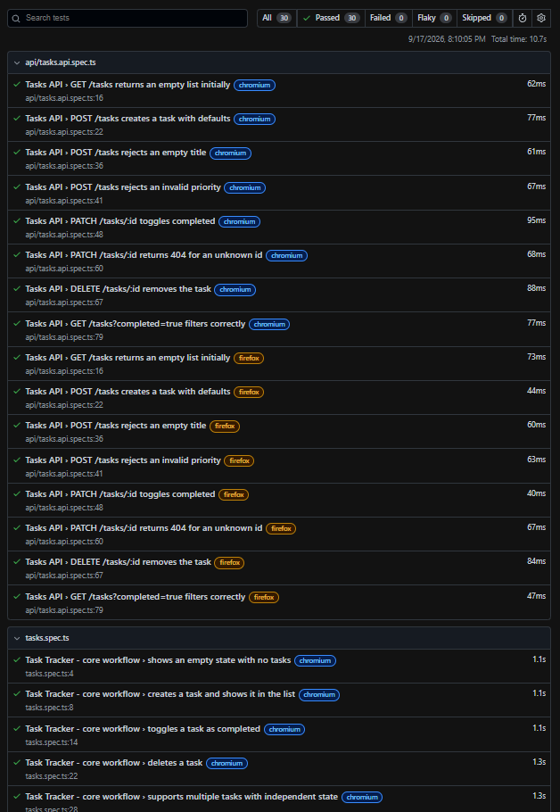

# QA Automation & Insights Platform

A small Task Tracker app built specifically as the **system-under-test**
for a full automation stack: Playwright E2E + API suites, a
GitHub Actions CI/CD pipeline, and a quality/delivery metrics
dashboard. Built to demonstrate the skill set for automation-focused
engineering roles (React/TypeScript, Playwright, CI/CD, AI-assisted
development with Claude Code).



## Why this project exists

The app itself is intentionally simple. The point isn't the task
tracker - it's everything wrapped around it:

- A **Page Object Model** Playwright framework, not ad-hoc scripts
- Separate **E2E** and **API-level** test suites
- **Regression guardrails** for a specific bug class (blank/whitespace task titles)
- A **CI/CD pipeline** that typechecks, unit-tests, runs the full Playwright
  suite across two browsers, uploads the HTML report, and gates a deploy
  preview on everything passing
- A **metrics dashboard** for pass rate, flaky tests, build duration, and
  deployment frequency

## Structure

```
backend/     FastAPI app (system under test) + pytest unit tests
frontend/    React + TypeScript + Vite app, includes /dashboard view
e2e/         Playwright test suite (Page Object Model, E2E + API tests)
.github/     CI/CD workflow
```

## Running it locally

**1. Backend**
```bash
cd backend
pip install -r requirements.txt
uvicorn main:app --reload --port 8000
```

**2. Frontend** (separate terminal)
```bash
cd frontend
npm install
npm run dev
```
Visit http://localhost:5173

**3. Backend unit tests**
```bash
cd backend
pip install pytest httpx
pytest -v
```

**4. Playwright suite** (separate terminal, backend/frontend can be
running or Playwright will start them itself via `webServer` config)
```bash
cd e2e
npm install
npx playwright install --with-deps   # downloads browser binaries
npm test              # full suite
npm run test:e2e      # UI tests only
npm run test:api      # API tests only
npm run test:ui       # interactive UI mode
npm run report        # view the last HTML report
```

## CI/CD

`.github/workflows/ci.yml` runs on every PR and push to `main`:
1. Frontend typecheck
2. Backend unit tests (pytest)
3. Playwright suite (Chromium + Firefox), with the HTML report uploaded
   as a build artifact
4. A Vercel preview deploy, gated on step 3 passing

To use the deploy step, add a `VERCEL_TOKEN` secret to the repo (or
delete that job if you're not using Vercel).

## Where Claude Code fit into this

While setting this project up locally, `npm test` came back with 18
failures. Rather than just re-running until it went green, I walked
Claude Code through diagnosing each failure category and asked it to
find and fix the real bugs, not paper over the symptoms.

**Bug 1: a race condition in the Page Object Model.**
`TaskPage.toggleTask()` clicked the checkbox and returned immediately.
But the checkbox's `data-completed` state only updates after the
`PATCH` request and a subsequent `refresh()` resolve - a real async
round trip. Playwright's `click()` resolves as soon as the click event
fires, not once that chain settles, so the very next assertion could
read stale state. Fix: `toggleTask()` now waits for the checkbox's
checked state to actually flip via an auto-retrying `expect(...)`
before returning, instead of a fire-and-forget click.

**Bug 2: no isolation between parallel Playwright workers.**
The suite already reset the backend between tests via `DELETE /tasks`
- but that reset was global against a single shared in-memory store.
With `fullyParallel: true` and multiple workers, one worker's reset
(to start its next test clean) could wipe out tasks another worker was
mid-test with, producing intermittent "empty state not found" and
task-count-mismatch failures that only showed up under parallelism and
passed reliably with `--workers=1`. Fix: backend storage is now
partitioned by an `X-Test-Worker` header, and the Playwright fixtures
attach that header to both API requests and the browser's own fetches,
so each worker gets an isolated slice of storage while the suite stays
genuinely parallel (requests without the header fall back to a shared
`"default"` partition for normal, non-test use).

What this demonstrates about the workflow: Claude Code didn't just
"make the red tests green" - for each failure it distinguished
environment/setup issues (missing browsers, PATH problems) from test
bugs (the race condition) from architecture gaps (the isolation
issue), and proposed the actual fix at the right layer rather than
retrying, upping timeouts, or serializing the suite as a workaround.
The isolation fix in particular was flagged as a judgment call - fix
properly vs. pin to one worker - and only implemented after asking
which tradeoff I wanted.

## Extending this into a "real" dashboard

Right now `frontend/src/dashboard/metrics-data.ts` is mock data. The
natural next step: add a small script (`scripts/parse-report.ts` or
similar) that reads Playwright's `--reporter=json` output after each
CI run and appends a row to a real store (a JSON file committed by
CI, a lightweight DB, or Power BI if you want to reuse that skill).
Worth doing before treating this as a finished piece - "wired to a
real pipeline" is a meaningfully stronger claim than "mock data."

## What this demonstrates

| Job requirement | Where |
|---|---|
| ReactJS + TypeScript | `frontend/` |
| Playwright automated testing | `e2e/tests/` |
| Claude Code / AI-assisted dev | See section above |
| Test automation frameworks | POM in `e2e/tests/pages/`, fixtures in `e2e/tests/fixtures.ts` |
| E2E, API, integration, regression suites | `e2e/tests/tasks.spec.ts` (E2E + regression), `e2e/tests/api/` (API) |
| Git, CI/CD, Agile/QA practices | `.github/workflows/ci.yml` |
| Dashboards/reporting on quality metrics | `frontend/src/dashboard/` |
